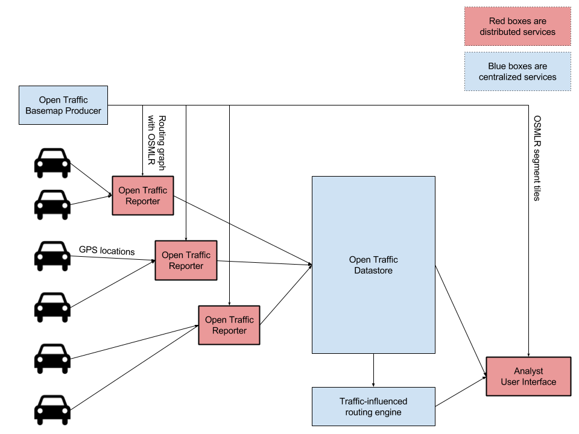
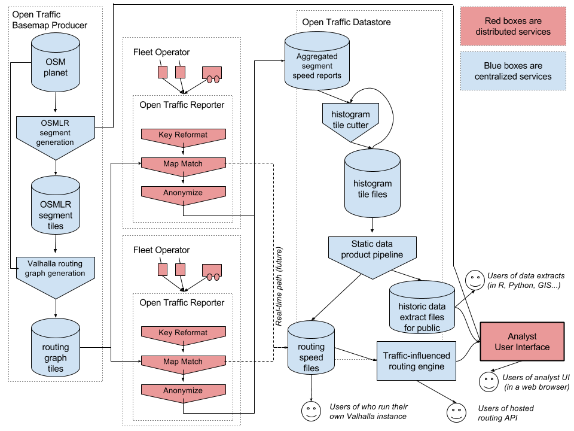
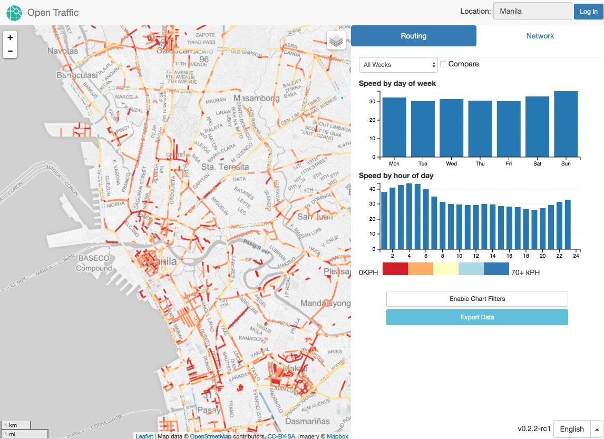
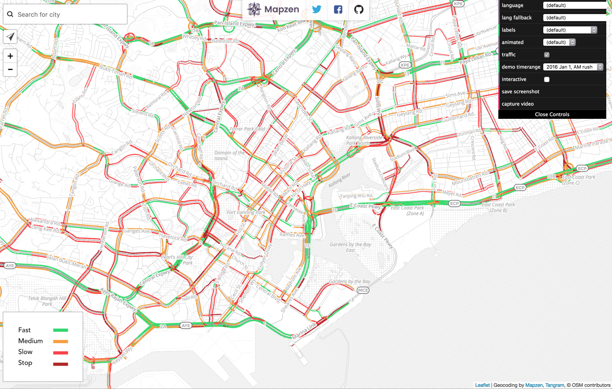

***OTv2 is currently under development. The following docs and diagrams may change&mdash;and may not exactly reflect the state of work-in-progress.***

# Open Traffic v2 platform

Open Traffic is a global data platform to process anonymous positions of vehicles and smartphones into real-time and historical traffic statistics. We're building this in the open, using fully open-source software, with involvement from a growing list of partners.

After a successful proof-of-concept by the World Bank, Grab, and Conveyal (known as OTv1), Mapzen is working with the partners to build out a new version of the platform that will scale to have global coverage (known as OTv2). For more information on OTv1, see the [opentraffic/architecture](https://github.com/opentraffic/architecture) repository.

## Basic technical architecture

The OTv2 platform is built of both distributed and centralized services:

<!-- To view and edit the original diagram: https://docs.google.com/drawings/d/1pOKafG_SjF6xovM-gJ1By1rSYHyOV1LnmQ15lmvH5cg/edit -->

From left to right the components in this diagram are:

1. **Open Traffic Basemap Producer** is a centralized service. On a regular basis, it ingests OpenStreetMap data and outputs the OSMLR segments against which traffic statistics are matched, reported, stored, and displayed.
2. **Open Traffic Reporter** is run by each organization that contributes probe data to Open Trafic. Each Reporter instance ingests GPS location streams, map-matches those locations against OSMLR segments, aggregates these locations into anonymous speed statistics.
3. **Open Traffic Datastore** receives and merges together the anonymous speed statistics from all of the Reporter instances. Datastore creates a variety of public data extracts from its historical records of traffic statistics, including space/time tile files to power the Analyst User Interface and routing graph tile files to power a traffic-influenced routing engine.
4. An instance of Valhalla serves as a **traffic-influenced routing engine**.
5. **Open Traffic Analyst User Interface** serves as an easy-to-use view into Open Traffic's historical speed and observation count data, allowing basic querying by area, time, and route.

## More detailed technical architecture

The same as above, with more detail on the specific pieces within each component and the data flows between components:

<!-- To view and edit the original diagram: https://docs.google.com/drawings/d/1QkKfTWyp2DveSIVjVYfMm0IcfDuAii_VC6Tj5QB_U44/edit -->

## System Components

### OSMLR segment generation

The [OSMLR application](https://github.com/opentraffic/osmlr) creates traffic segments according to the [OSMLR tile spec](https://github.com/opentraffic/osmlr-tile-spec). Outputs are in protocol buffer and GeoJSON formats. This process will be run on a regular basis, on centralized servers, with the resulting worldwide OSMLR tile set available for free use by all.

→ See [this blog post](https://mapzen.com/blog/open-traffic-osmlr-technical-preview) for an introduction to OSMLR. 

### Reporter

Reporter takes in raw GPS probe data, matches it to OSMLR segments using [Valhalla Meili](https://github.com/valhalla/valhalla/blob/master/docs/meili.md), and sends segments and speeds to the centralized Open Traffic Datastore.

Reporter is available as a set of Docker containers, or can be run anywhere Python and Redis are available.

Reporter expects its input of GPS points as HTTP requests. It also includes a script to parse CSV files and generate the appropriate HTTP requests. The code can be customized to act on a stream (such as Apache Kafka or AWS Kinesis).

(In OTv1, this component was called the [Traffic Engine](https://github.com/opentraffic/traffic-engine).)

→ See more documentation in [the Reporter repository](https://github.com/opentraffic/reporter).

### Datastore

The [Datastore](https://github.com/opentraffic/datastore) ingests input from distributed [Reporter](https://github.com/opentraffic/reporter) instances. Its contents can be queried using the [Open Traffic API](https://github.com/opentraffic/api). The Datastore is also used to created processed data products.

API outputs and processed data products include a range of statistics computed on anonymized and aggregated traffic speeds. Statistics are associated with OSMLR segments.

(In OTv1, this component was called the Data Pool. Its API was called the [Traffic Engine App](https://github.com/opentraffic/traffic-engine-app).)

### Analysis web interfaces

For users unable to directly query an API or parse a static data extract, OTv2 will provide a simple web app for performing basic queries.

(In OTv1, this component was the [Traffic Engine App](https://github.com/opentraffic/traffic-engine-app).) Here is a screenshot of the OTv1 interface in action:

Slightly more advanced users are provided with sample queries in Jupyter Notebooks, which they can expand using Python tooling (such as SciPy, Pandas, and Matplotlib).

### Traffic-influenced routing engine

The [Valhalla routing engine](https://github.com/valhalla) will offer journey-planning that is weighted by historical and real-time speeds.

→ See [this blog post](https://mapzen.com/blog/speed-tiles/) for a proof-of-concept using traffic speeds to influence Valhalla routing.

### Traffic maps

The Datastore will also generate static data extracts that can be used to power user-facing traffic maps.

→ See [this demo](https://mapzen.github.io/open-traffic-poc-data-demo/) using the Tangram map rendering library to display an entire day's worth of traffic in Manila (from the OTv1 platform). Here is an animated screenshot of some of the map:

→ See [this code](https://github.com/opentraffic/tangram-viz-experiments) using the Tangram map rendering library to display speeds from the OTv2 API. Here is a screenshot of this map showing traffic in Singapore:

